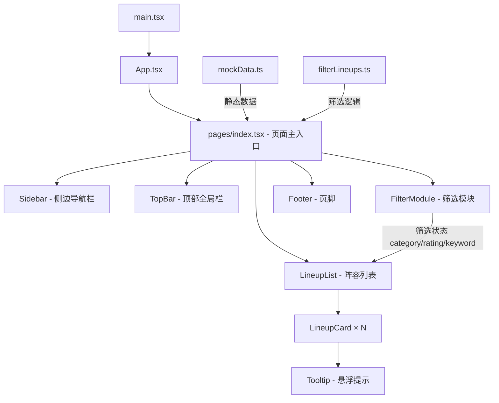
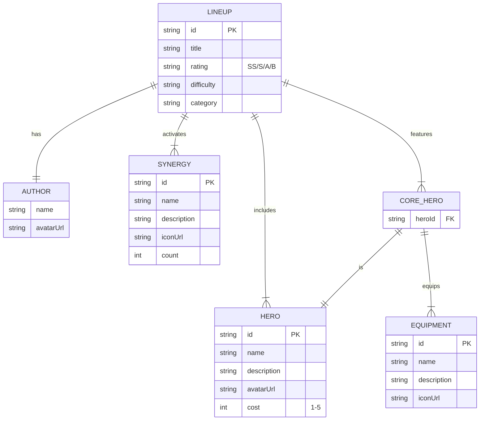

# 阵容推荐页 - 项目设计文档

## 系统架构



## ER 图



## 接口清单

### 页面状态管理 (pages/index.tsx)

| 状态 | 类型 | 说明 |
|------|------|------|
| activeNav | string | 当前导航项 |
| sidebarOpen | boolean | 移动端侧边栏展开状态 |
| currentVersion | string | 当前游戏版本 |
| activeCategory | string | 当前分类筛选 |
| activeRating | string | 当前评级筛选 |
| searchKeyword | string | 搜索关键词 |

### 组件 Props 接口

| 组件 | 核心 Props |
|------|-----------|
| Sidebar | activeNav, onNavClick, isOpen, onClose |
| TopBar | currentVersion, versions, onVersionChange, onMenuToggle |
| FilterModule | activeCategory, activeRating, searchKeyword, onChange handlers |
| LineupList | lineups: Lineup[], loading: boolean |
| LineupCard | lineup: Lineup, onClick: (id) => void |
| Tooltip | content: {name, description}, children |

### 筛选函数

```
filterLineups(lineups: Lineup[], criteria: FilterCriteria) => Lineup[]
- category: 按分类精确匹配，"all" 返回全部
- rating: 按评级精确匹配，"" 不限
- keyword: 标题或英雄名称模糊匹配（不区分大小写）
- 多条件取交集
```

## UI/UX 规范

| 属性 | 值 |
|------|-----|
| 主背景色 | #1a1525 (深紫灰) |
| 卡片背景色 | #2d2640 |
| 主文案色 | #ffffff |
| 辅助文案色 | #a09bb0 |
| 科技绿 | #00e5a0 |
| 金色 | #ffd700 |
| 圆角 (小) | 6px |
| 圆角 (中) | 10px |
| 圆角 (大) | 16px |
| 侧边栏宽度 | 72px |
| 顶栏高度 | 56px |
| 移动端断点 | 768px |
